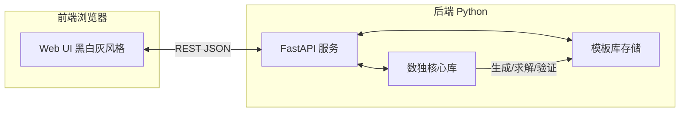
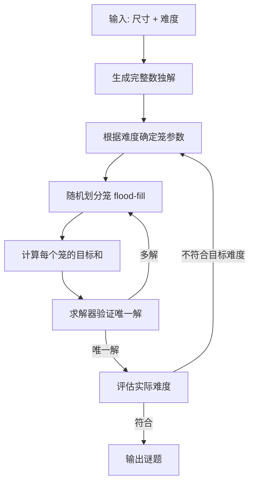
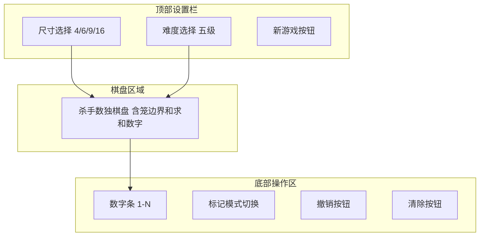

# 杀手数独 Web 应用 - 架构设计

## 一、项目概述

构建一个支持多种棋盘尺寸（4×4、6×6、9×9、16×16）和五种难度（入门、简单、中等、困难、专家）的**杀手数独** Web 应用。采用 Python 后端 + 原生前端技术栈，黑白灰风格，适配手机端。

### 核心特性
- 杀手数独生成器（含笼划分与求和线索）
- 求解器与验证器
- 模板库（预生成谜题存储）
- 可游玩的 Web 界面（填数、检索、高亮、撤销、标记、通关记录）

---

## 二、技术选型

| 层级 | 技术 | 理由 |
|------|------|------|
| 后端框架 | FastAPI | 现代、高性能、自动生成 API 文档 |
| 核心算法 | Python 标准库 | 纯算法实现，无额外依赖 |
| 模板存储 | JSON 文件 | 轻量，无需数据库，便于迁移 |
| 前端 | 原生 HTML/CSS/JS | 无构建步骤，轻量，易于部署 |
| API 通信 | REST + JSON | 简单通用 |

---

## 三、系统架构



### 数据流
1. 用户在前端选择尺寸和难度 → 调用 API 获取谜题
2. 后端从模板库取预生成谜题，若无则实时生成并缓存
3. 前端渲染棋盘、笼、求和线索
4. 用户填数 → 前端本地管理状态 → 完成时调用 API 验证
5. 验证通过 → 标记通关，记录到本地存储

---

## 四、目录结构

```
sudoku/
├── backend/
│   ├── sudoku_core/              # 核心数独库
│   │   ├── __init__.py
│   │   ├── models.py             # 数据模型（Board, Cage, Puzzle）
│   │   ├── generator.py          # 杀手数独生成器
│   │   ├── solver.py             # 求解器（回溯+约束传播）
│   │   ├── validator.py          # 验证器
│   │   ├── cage_builder.py       # 笼划分算法
│   │   └── difficulty.py         # 难度评估与控制
│   ├── api/
│   │   ├── __init__.py
│   │   ├── main.py               # FastAPI 应用入口
│   │   └── routes.py             # API 路由
│   ├── storage/
│   │   ├── __init__.py
│   │   └── repository.py         # 模板库读写
│   ├── templates_db/             # 预生成谜题存储（JSON）
│   │   ├── 4x4/
│   │   ├── 6x6/
│   │   ├── 9x9/
│   │   └── 16x16/
│   ├── tests/
│   │   ├── test_generator.py
│   │   ├── test_solver.py
│   │   └── test_validator.py
│   └── requirements.txt
├── frontend/
│   ├── index.html
│   ├── css/
│   │   ├── style.css             # 全局黑白灰风格
│   │   └── board.css             # 棋盘专用样式
│   ├── js/
│   │   ├── app.js                # 主应用入口与状态管理
│   │   ├── board.js              # 棋盘渲染与交互
│   │   ├── api.js                # 后端 API 调用封装
│   │   └── storage.js            # 本地存储（通关记录等）
│   └── assets/
│       └── icons/
├── plans/
│   └── architecture.md           # 本文档
└── README.md
```

---

## 五、核心数据模型

### 5.1 棋盘配置

```python
# 不同尺寸的宫格划分
BOARD_CONFIGS = {
    4:  {"box_rows": 2, "box_cols": 2, "symbols": range(1, 5)},   # 4x4: 2x2宫
    6:  {"box_rows": 2, "box_cols": 3, "symbols": range(1, 7)},   # 6x6: 2x3宫
    9:  {"box_rows": 3, "box_cols": 3, "symbols": range(1, 10)},  # 9x9: 3x3宫
    16: {"box_rows": 4, "box_cols": 4, "symbols": range(1, 17)},  # 16x16: 4x4宫
}
```

### 5.2 核心类

```python
@dataclass
class Cage:
    """笼：一组单元格及其目标和"""
    cells: list[tuple[int, int]]   # 单元格坐标列表
    target_sum: int                # 目标和
    size: int                      # 笼大小（单元格数）

@dataclass
class Puzzle:
    """完整谜题"""
    size: int                      # 棋盘尺寸（4/6/9/16）
    cages: list[Cage]              # 所有笼
    solution: list[list[int]]      # 完整解（用于验证）
    difficulty: str                # 难度级别
    puzzle_id: str                 # 唯一标识

@dataclass
class GameState:
    """游戏状态（前端管理）"""
    puzzle: Puzzle
    user_grid: list[list[int]]     # 用户填入的数字
    notes: dict[tuple[int,int], set[int]]  # 标记的小字
    history: list[dict]            # 撤销历史（最多3步）
    completed: bool                # 是否通关
```

---

## 六、核心算法设计

### 6.1 杀手数独生成流程



### 6.2 笼划分算法

1. **初始化**：所有单元格未分配
2. **随机种子**：随机选择未分配单元格作为新笼起点
3. **Flood-fill 扩展**：从起点向相邻未分配单元格扩展
4. **控制笼大小**：根据难度限制最小/最大笼大小
   - 入门：笼较大（3-5格），笼数量少
   - 专家：笼较小（1-3格），笼数量多
5. **重复**直到所有单元格被分配

### 6.3 难度控制策略

| 难度 | 笼大小范围 | 笼数量 | 求解技巧要求 |
|------|-----------|--------|-------------|
| 入门 | 3-5格 | 少 | 仅基础求和排除 |
| 简单 | 2-4格 | 中少 | 求和排除 + 唯一候选 |
| 中等 | 2-4格 | 中 | 上述 + 隐性唯一 |
| 困难 | 1-3格 | 中多 | 上述 + 区块排除 |
| 专家 | 1-3格 | 多 | 需要复杂推理/试错 |

### 6.4 求解器

采用**回溯 + 约束传播**：
1. 约束传播：行/列/宫唯一性 + 笼和约束
2. 选择候选最少的单元格优先填充（MRV 启发式）
3. 回溯搜索
4. 用于：验证唯一解、评估难度

### 6.5 验证器

- 检查行/列/宫无重复
- 检查每个笼的和等于目标值
- 检查笼内无重复
- 与预存 solution 对比

---

## 七、API 设计

### 7.1 获取谜题

```
GET /api/puzzle?size=9&difficulty=medium
```

**响应：**
```json
{
  "puzzle_id": "9x9_medium_abc123",
  "size": 9,
  "difficulty": "medium",
  "cages": [
    {"cells": [[0,0],[0,1]], "target_sum": 7, "size": 2},
    ...
  ]
}
```

### 7.2 验证解答

```
POST /api/validate
Body: {"puzzle_id": "...", "solution": [[...]]}
```

**响应：**
```json
{
  "valid": true,
  "errors": []
}
```

### 7.3 预生成模板

```
POST /api/admin/generate?size=9&difficulty=medium&count=10
```
（批量预生成并存入模板库）

---

## 八、前端设计

### 8.1 布局结构



### 8.2 交互功能映射

| 需求 | 实现方式 |
|------|---------|
| 选择棋盘大小 | 顶部下拉/按钮组，切换后重新获取谜题 |
| 填入数字 | 点击单元格选中 → 点击数字条填入 |
| 检索功能（数字条变灰） | 统计已填入的各数字数量，达到尺寸上限时该数字变灰 |
| 强调高亮 | 选中单元格时，棋盘上同数字单元格高亮 |
| 难度选项 | 顶部难度选择器 |
| 撤销（3步） | 维护 history 栈，最多保留3步，撤销按钮回退 |
| 标记小字 | 标记模式下，点击数字在单元格内显示小字候选 |
| 通关标记 | 验证通过后，localStorage 记录 puzzle_id 为已通关 |

### 8.3 黑白灰配色方案

```css
:root {
  --color-bg: #f5f5f5;          /* 背景：浅灰 */
  --color-surface: #ffffff;      /* 卡片：白 */
  --color-border: #333333;       /* 笼边界：深灰/黑 */
  --color-grid: #999999;         /* 网格线：中灰 */
  --color-text: #1a1a1a;         /* 主文字：近黑 */
  --color-text-secondary: #666666;/* 次要文字：灰 */
  --color-highlight: #d0d0d0;    /* 高亮：浅灰 */
  --color-selected: #b0b0b0;     /* 选中：中灰 */
  --color-disabled: #cccccc;     /* 禁用/变灰：浅灰 */
  --color-cage-sum: #444444;     /* 笼和数字：深灰 */
  --color-note: #888888;         /* 标记小字：灰 */
}
```

### 8.4 响应式适配

- 使用 CSS Grid 布局棋盘，`aspect-ratio: 1` 保持正方形
- 媒体查询：手机端数字条改为底部固定，按钮简化
- 触摸事件支持（touchstart/touchend）
- 单元格尺寸用 `vmin` 单位自适应

---

## 九、模板库设计

### 9.1 存储结构

```
templates_db/
├── 9x9/
│   ├── beginner/
│   │   ├── 001.json
│   │   └── 002.json
│   ├── easy/
│   ├── medium/
│   ├── hard/
│   └── expert/
├── 4x4/...
├── 6x6/...
└── 16x16/...
```

### 9.2 单个谜题 JSON 格式

```json
{
  "puzzle_id": "9x9_medium_001",
  "size": 9,
  "difficulty": "medium",
  "cages": [
    {"cells": [[0,0],[0,1],[1,0]], "target_sum": 15, "size": 3}
  ],
  "solution": [[5,3,4,...],...],
  "created_at": "2026-08-19T12:00:00Z"
}
```

### 9.3 策略

- 启动时/后台预生成每种组合若干谜题
- API 请求时优先从模板库随机取
- 模板库不足时实时生成并补充
- 每种尺寸×难度至少缓存 20 个谜题

---

## 十、实施阶段

### 阶段一：核心数独库（Python）
1. 设计数据模型（`models.py`）
2. 实现求解器（`solver.py`）— 回溯+约束传播
3. 实现笼划分算法（`cage_builder.py`）
4. 实现生成器（`generator.py`）— 组合上述组件
5. 实现难度评估（`difficulty.py`）
6. 实现验证器（`validator.py`）
7. 编写单元测试

### 阶段二：后端 API 与模板库
1. 搭建 FastAPI 项目
2. 实现模板库存储（`repository.py`）
3. 实现 API 路由（获取谜题、验证解答、预生成）
4. 预生成初始模板库

### 阶段三：前端 Web 应用
1. 搭建前端项目结构与 HTML 骨架
2. 实现黑白灰 CSS 样式与响应式布局
3. 实现棋盘渲染（笼边界、求和线索）
4. 实现填数交互逻辑
5. 实现检索功能（数字条变灰）
6. 实现强调高亮功能
7. 实现撤销功能（3步历史栈）
8. 实现标记功能（小字笔记）
9. 实现通关标记（localStorage）

### 阶段四：集成与测试
1. 前后端联调
2. 四种尺寸 × 五种难度全覆盖测试
3. 移动端适配验证
4. 性能优化（16×16 生成耗时）

---

## 十一、风险与注意事项

| 风险 | 应对 |
|------|------|
| 16×16 生成耗时过长 | 限制笼大小、超时降级为模板库取用 |
| 难度评估不准确 | 结合笼参数 + 求解器搜索深度综合判断 |
| 唯一解验证慢 | 求解器找到第二解即提前终止 |
| 前端 16×16 棋盘拥挤 | 响应式字号 + 可缩放/滚动 |
| 手机端触摸误触 | 单元格最小尺寸限制 + 点击反馈 |
