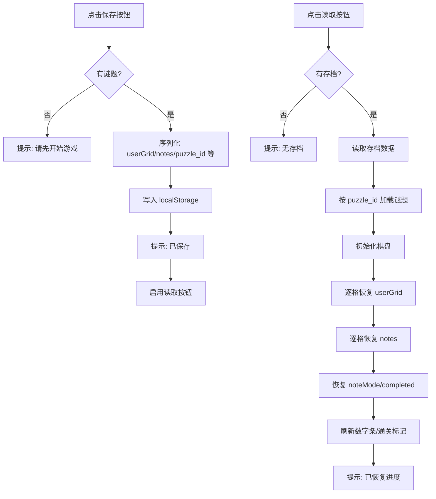

# 保存/读取进度功能计划

## 目标
为数独游戏添加临时存档机制：保存当前填数与笔记，下次可读取恢复。两个按钮（保存、读取）加在"新游戏"按钮后面。

## 设计决策
- **单存档槽**：覆盖式保存（符合"临时保存"需求，简单实用）
- **存储介质**：localStorage（与现有 [`storage.js`](frontend/js/storage.js:3) 通关记录一致）
- **存档内容**：puzzle_id、size、difficulty、userGrid、notes、noteMode、completed、savedAt
- **读取流程**：按 puzzle_id 重新加载谜题数据（cages/solution），再恢复填数与笔记
- **通关后**：自动清除存档（已通关无需继续）
- **读取时**：直接覆盖当前进度（用户主动操作）

## 数据结构
```json
{
  "puzzle_id": "9x9_expert_xxx",
  "size": 9,
  "difficulty": "expert",
  "userGrid": [[0,5,...],...],
  "notes": { "0,1": [3,7], "2,3": [1] },
  "noteMode": false,
  "completed": false,
  "savedAt": 1724486400000
}
```
> notes 的 Set 序列化为数组，读取时转回 Set。

## 流程图



## 实现步骤

### 1. 扩展 [`storage.js`](frontend/js/storage.js:3)
新增常量 `PROGRESS_KEY` 和方法：
- `saveProgress(data)` — 序列化并存入 localStorage
- `loadProgress()` — 读取并返回存档对象（无则 null）
- `hasProgress()` — 是否存在存档
- `clearProgress()` — 清除存档

### 2. 修改 [`index.html`](frontend/index.html:34)
在 `#new-game-btn` 后添加两个按钮：
```html
<button id="save-btn" class="btn btn-secondary">保存</button>
<button id="load-btn" class="btn btn-secondary" disabled>读取</button>
```

### 3. 修改 [`app.js`](frontend/js/app.js:67) — 事件绑定
在 `_bindEvents()` 中绑定 `#save-btn`、`#load-btn` 点击事件。

### 4. 修改 [`app.js`](frontend/js/app.js:126) — 保存逻辑
新增 `saveProgress()` 方法：
- 校验 `this.puzzle` 存在
- 序列化 userGrid（二维数组直接可序列化）
- 序列化 notes（Set → 数组）
- 调用 `Storage.saveProgress()`
- 更新读取按钮状态、状态栏提示

### 5. 修改 [`app.js`](frontend/js/app.js:126) — 读取逻辑
新增 `loadProgress()` 方法：
- 调用 `Storage.loadProgress()`，无存档则提示
- 调用 `API.getPuzzleById(puzzle_id)` 重新加载谜题
- 调用 `_loadPuzzle(puzzle)` 初始化棋盘
- 逐格恢复 userGrid：`Board.setCellValue(r, c, val)`
- 逐格恢复 notes：数组转 Set，`Board.setCellNotes(r, c, set)`
- 恢复 noteMode、completed 状态
- 刷新数字条、通关标记、撤销按钮

### 6. 修改 [`app.js`](frontend/js/app.js:20) — 初始化检测
在 `init()` 末尾调用 `_updateLoadButton()`，根据是否有存档启用/禁用读取按钮。

### 7. 修改 [`app.js`](frontend/js/app.js:462) — 通关清除存档
在 `_onComplete()` 中调用 `Storage.clearProgress()` 并更新读取按钮。

### 8. 修改 [`css/style.css`](frontend/css/style.css:139) — 按钮样式
新增 `.btn-secondary` 样式，与新游戏按钮协调但略有区分。

## 涉及文件
| 文件 | 改动 |
|------|------|
| [`frontend/js/storage.js`](frontend/js/storage.js:3) | 新增存档读写方法 |
| [`frontend/index.html`](frontend/index.html:34) | 新增两个按钮 |
| [`frontend/js/app.js`](frontend/js/app.js:3) | 保存/读取逻辑、事件绑定、初始化检测 |
| [`frontend/css/style.css`](frontend/css/style.css:139) | 新增按钮样式 |
